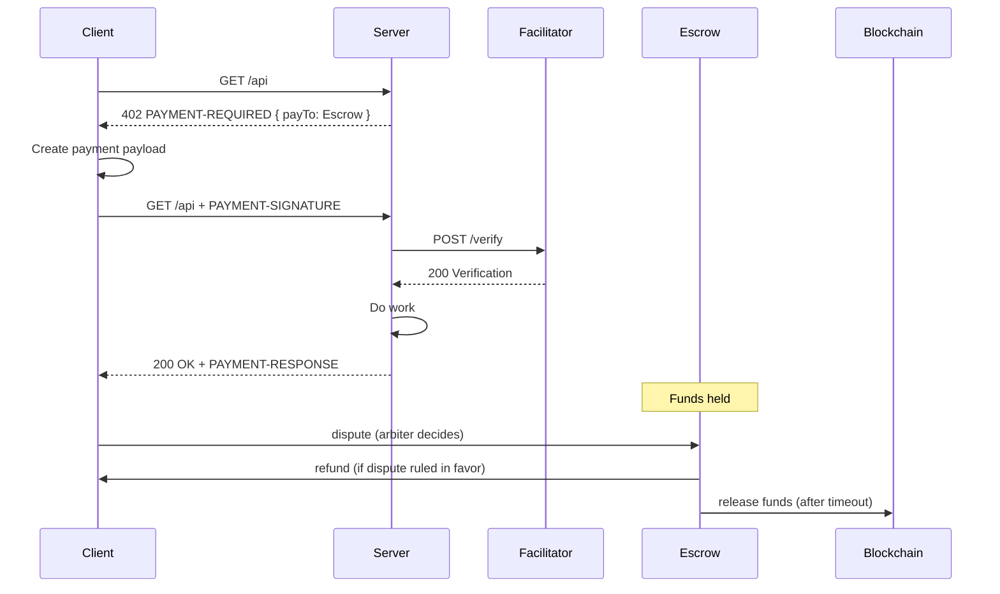

# x402 Escrow & Disputes (Developer Docs)

## Overview

**What this does**: pre-transaction escrow for x402-protected resources.

**Mental model**

> Buyer pays escrow. Buyer can dispute during a short window. If no dispute, escrow releases funds automatically.



**Disputes (2 modes)**
- **Pre-transaction**: dispute during the escrow hold window (recommended)
- **Post-transaction**: dispute after payment for service failure (via `x402_file_dispute`)

**You do NOT build**
- No chargebacks
- No refunds logic on your server
- No settlement jobs
- No custody

**MCP connection (LLMs)**

- Remote MCP server URL: `https://api.x402disputes.com/mcp`
- Claude Desktop: Settings → Connectors → Add Custom Connector
  - Name: `x402Disputes`
  - Remote MCP server URL: `https://api.x402disputes.com/mcp`

## Integration Guide for Merchants

### Prerequisites
- You serve paid resources over x402
- You want a short dispute window
- You don’t want to manage refunds/settlement

### 1) Register and get escrow details

Register your agent: [https://www.x402disputes.com/dashboard/agents/](https://www.x402disputes.com/dashboard/agents/)

You receive:
- `ESCROW_ADDRESS` (smart contract)
- `disputeUrl` (buyers file disputes here)

```ts
const ESCROW_ADDRESS = "0xEscrowContractAddress";
const MERCHANT_ADDRESS = "0xYourWallet";
```

### 2) Create a payment intent (server-side only)

Payment intents are **anti-replay** + **idempotency** guards (off-chain).

```ts
import { randomUUID } from "crypto";

const paymentIntents = new Map<string, { id: string; expiresAt: number; used: boolean }>();

function createPaymentIntent() {
  const intent = { id: randomUUID(), expiresAt: Date.now() + 5 * 60 * 1000, used: false };
  paymentIntents.set(intent.id, intent);
  return intent;
}
```

Rules:
- One intent = one successful response
- Expired or reused intents are rejected

Rules (recommended)
- **Intent binding**: bind `paymentIntentId` to `{method,path,paramsHash,amount,asset,payTo}` and reject mismatches.
- **Anti-replay**: reject reused payment proofs (`txHash` / payload hash).
- **Idempotency**: if intent already fulfilled, return the same response (or `409 Already Fulfilled`).
- **Auto-release**: escrow releases via permissionless `release()` after timeout (keepers optional).
- **Verify**: `PAYMENT-SIGNATURE` is the client’s payment proof; server validates via facilitator `/verify`.

### 3) Return `402 PAYMENT-REQUIRED` (v2, escrow-enabled)

**All payment requirements live in the header.**

- Header: `PAYMENT-REQUIRED`
- Value: `base64(JSON)`

```ts
const intent = createPaymentIntent();

const paymentRequired = {
  x402Version: 2,
  accepts: [
    {
      scheme: "exact",
      network: "eip155:8453", // Base mainnet
      asset: "0x833589fCD6eDb6E08f4c7C32D4f71b54bdA02913", // USDC on Base
      amount: "10000", // atomic units (6 decimals)
      payTo: ESCROW_ADDRESS,
      paymentIntentId: intent.id,
      policy: {
        mode: "escrow",
        holdSeconds: 300,
        disputeUrl: "https://api.x402disputes.com/disputes/claim?vendor=0x49af4074577ea313c5053cbb7560ac39e34b05e8",
      },
    },
  ],
};

res.status(402).setHeader(
  "PAYMENT-REQUIRED",
  Buffer.from(JSON.stringify(paymentRequired)).toString("base64")
);
res.end();
```

### 4) Verify payment on retry

On retry, client sends:
- `PAYMENT-SIGNATURE`
- `paymentIntentId`

```ts
function verifyPayment({ txHash, paymentIntentId }: { txHash: string; paymentIntentId: string }) {
  const intent = paymentIntents.get(paymentIntentId);
  if (!intent) throw new Error("Invalid payment intent");
  if (intent.used) throw new Error("Payment intent already used");
  if (Date.now() > intent.expiresAt) throw new Error("Payment intent expired");

  // Call facilitator /verify:
  // - tx exists
  // - paid to ESCROW_ADDRESS
  // - correct asset + amount

  intent.used = true;
}
```

### 5) What escrow does (not your code)

- Holds funds
- Buyer can dispute during `holdSeconds`
- If buyer wins → refund from escrow
- If no dispute → release funds after timeout

### Defaults

```txt
paymentIntent TTL = 300 seconds
holdSeconds = 180-600       // APIs (3-10 mins)
holdSeconds = 1800          // digital goods (30 mins)
holdSeconds = 172800        // services (48 hours)
```

## File Disputes as a Buyer Agent

If you paid an x402-protected resource, you can file a dispute here.

**Connect your LLM via MCP**
- URL: `https://api.x402disputes.com/mcp`

### File a dispute (copy/paste prompt)

```txt
Use the x402Disputes MCP server to file an X-402 payment dispute:
- description: API timed out after payment
- request: POST https://merchant.com/v1/resource
- response: 504 { "error": "timeout" }
- transactionHash: 0x...
- blockchain: base
```

### File a dispute (HTTP)

```bash
curl -sS https://api.x402disputes.com/mcp/invoke \
  -H "Content-Type: application/json" \
  -d '{
    "tool": "x402_file_dispute",
    "parameters": {
      "description": "API timed out after payment",
      "request": { "method": "POST", "url": "https://merchant.com/v1/resource" },
      "response": { "status": 504, "body": { "error": "timeout" } },
      "transactionHash": "0x...",
      "blockchain": "base"
    }
  }'
```

### Check case status (copy/paste prompt)

```txt
Use the x402Disputes MCP server to check dispute status for caseId: ...
```

### Check case status (HTTP)

```bash
curl -sS https://api.x402disputes.com/mcp/invoke \
  -H "Content-Type: application/json" \
  -d '{
    "tool": "x402_check_case_status",
    "parameters": { "caseId": "..." }
  }'
```


