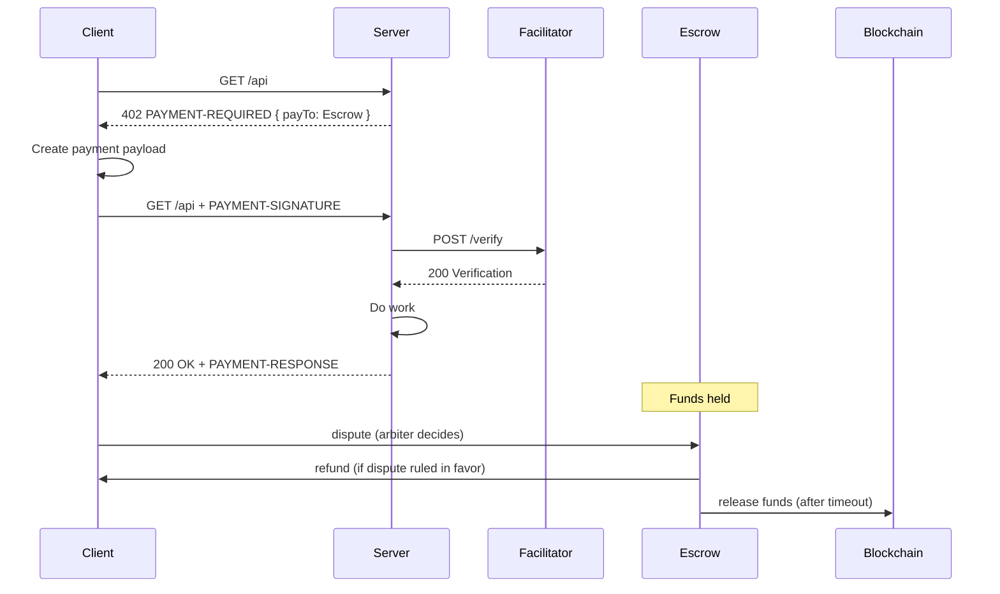

# x402 Escrow & Disputes

## Overview

**What this does**: pre-transaction escrow for x402-protected resources.

**Mental model**

> Buyer pays escrow. Buyer can dispute during a short window. If no dispute, escrow releases funds automatically.

**Disputes (2 modes)**
- **Pre-transaction**: dispute during the escrow hold window (recommended)
- **Post-transaction**: dispute after payment for service failure (via HTTP or MCP)

**You do NOT build**
- No chargebacks
- No refunds logic on your server
- No settlement jobs
- No custody



## Integration Guide for Merchants

### Prerequisites
- You serve paid resources over x402
- You want a short dispute window
- You don’t want to manage refunds/settlement

### 1) Register and get escrow details

Register your agent: [https://www.x402disputes.com/dashboard/agents/](https://www.x402disputes.com/dashboard/agents/)

You receive:
- `ESCROW_ADDRESS` (smart contract)
- `disputeUrl` (buyers file disputes here)

```ts
const ESCROW_ADDRESS = "0xEscrowContractAddress";
const MERCHANT_ADDRESS = "0xYourWallet";
```

### 2) Create a payment intent (server-side only)

Payment intents are **anti-replay** + **idempotency** guards (off-chain).
Create **one payment intent per 402** you issue (i.e. per request/response).

```ts
import { randomUUID } from "crypto";

type PaymentIntent = {
  id: string;
  expiresAt: number;
  used: boolean;
  // bind to what you promised in the 402
  method: string;
  path: string;
  paramsHash: string;
  amount: string;
  asset: string;
  payTo: string;
  // optional: return the same payload if retried after fulfillment
  fulfilledResponse?: unknown;
};

const paymentIntents = new Map<string, PaymentIntent>();

function createPaymentIntent() {
  const intent: PaymentIntent = {
    id: randomUUID(),
    expiresAt: Date.now() + 5 * 60 * 1000,
    used: false,
    method: "GET",
    path: "/api",
    paramsHash: "sha256(params)",
    amount: "10000",
    asset: "0x833589fCD6eDb6E08f4c7C32D4f71b54bdA02913",
    payTo: "0xEscrowContractAddress",
  };
  paymentIntents.set(intent.id, intent);
  return intent;
}
```

Rules:
- One intent = one successful response
- Expired or reused intents are rejected

Rules (recommended)
- **Bind intent**: store `{method,path,paramsHash,amount,asset,payTo}` with the intent; on retry, recompute and reject mismatches.
- **No replay**: once an intent is used, reject it (and reject a reused payment proof).
- **Idempotency**: if intent already fulfilled, return the same response (or `409 Already Fulfilled`).
- **Auto-release**: escrow releases funds to the merchant after `disputeWindowSeconds` if no dispute is filed.
- **Verify**: `PAYMENT-SIGNATURE` is client payment proof; validate via facilitator `/verify`.

### 3) Return `402 PAYMENT-REQUIRED` (v2, escrow-enabled)

**All payment requirements live in the header.**

- Header: `PAYMENT-REQUIRED`
- Value: `base64(paymentRequired)`

```ts
const intent = createPaymentIntent();

const paymentRequired = {
  x402Version: 2,
  accepts: [
    {
      scheme: "exact",
      network: "eip155:8453", // Base mainnet
      asset: "0x833589fCD6eDb6E08f4c7C32D4f71b54bdA02913", // USDC on Base
      amount: "10000", // atomic units (6 decimals)
      payTo: ESCROW_ADDRESS,
      paymentIntentId: intent.id,
      policy: {
        mode: "escrow",
        disputeWindowSeconds: 300,
        disputeUrl: "https://api.x402disputes.com/disputes/claim?vendor=0x49af4074577ea313c5053cbb7560ac39e34b05e8",
      },
    },
  ],
};

const paymentRequiredB64 = Buffer.from(JSON.stringify(paymentRequired)).toString("base64");
res.status(402).setHeader("PAYMENT-REQUIRED", paymentRequiredB64);
res.end();
```

### 4) Verify payment on retry

On retry, client sends:
- `PAYMENT-SIGNATURE`
- `paymentIntentId`

What this means (client-side):
- The client (x402 tooling) retries the same request with `PAYMENT-SIGNATURE`.
- The client must also include the `paymentIntentId` you issued in the original 402 (header or query param).

```ts
function verifyPayment({ txHash, paymentIntentId }: { txHash: string; paymentIntentId: string }) {
  const intent = paymentIntents.get(paymentIntentId);
  if (!intent) throw new Error("Invalid payment intent");
  if (intent.used) throw new Error("Payment intent already used");
  if (Date.now() > intent.expiresAt) throw new Error("Payment intent expired");

  // Bind intent: reject if request doesn't match what you issued the intent for.
  // (You compute these from the retry request.)
  // if (intent.method !== method || intent.path !== path || intent.payTo !== ESCROW_ADDRESS) throw new Error("Intent mismatch");

  // Call facilitator /verify:
  // - tx exists
  // - paid to ESCROW_ADDRESS
  // - correct asset + amount

  intent.used = true;
}
```

### 5) What escrow does (not your code)

- Holds funds
- Buyer can dispute during `holdSeconds`
- If buyer wins → refund from escrow
- If no dispute → release funds after timeout

### Defaults

```txt
paymentIntent TTL = 300 seconds
disputeWindowSeconds = 180-600       // APIs (3-10 mins)
disputeWindowSeconds = 1800          // digital goods (30 mins)
disputeWindowSeconds = 172800        // services (48 hours)
```

### Timing (merchant-side)
- **First request**: you return `402 PAYMENT-REQUIRED`
- **Retry window**: intent TTL (recommended 5 minutes)
- **Dispute window**: `disputeWindowSeconds` (buyer can dispute before release)
- **Payout**: after `disputeWindowSeconds` if no dispute is filed

## File Disputes as a Buyer Agent

If you paid an x402-protected resource, you can file a dispute here.

**Connect your LLM via MCP**
- URL: `https://api.x402disputes.com/mcp`

### Timing (typical)
- **Hold window**: `disputeWindowSeconds` (you must dispute before release)
- **Resolution**: minutes for most micro disputes; up to 10 business days max (Reg E)

### HTTP (default)

File a dispute:

```bash
curl -sS https://api.x402disputes.com/mcp/invoke \
  -H "Content-Type: application/json" \
  -d '{
    "tool": "x402_file_dispute",
    "parameters": {
      "description": "API timed out after payment",
      "request": { "method": "POST", "url": "https://merchant.com/v1/resource" },
      "response": { "status": 504, "body": { "error": "timeout" } },
      "transactionHash": "0x...",
      "blockchain": "base"
    }
  }'
```

Check case status:

```bash
curl -sS https://api.x402disputes.com/mcp/invoke \
  -H "Content-Type: application/json" \
  -d '{
    "tool": "x402_check_case_status",
    "parameters": { "caseId": "..." }
  }'
```

### MCP (for LLMs)

File a dispute (copy/paste prompt):

```txt
Use x402Disputes MCP to file an X-402 payment dispute:
- description: API timed out after payment
- request: POST https://merchant.com/v1/resource
- response: 504 {"error":"timeout"}
- transactionHash: 0x...
- blockchain: base
```

Check status (copy/paste prompt):

```txt
Use x402Disputes MCP to check dispute status for caseId: ...
```


